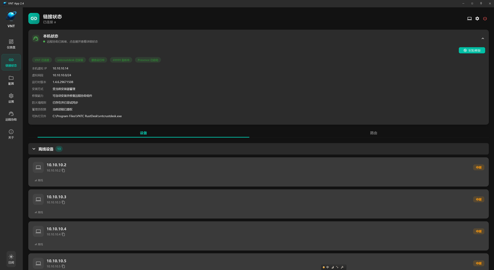
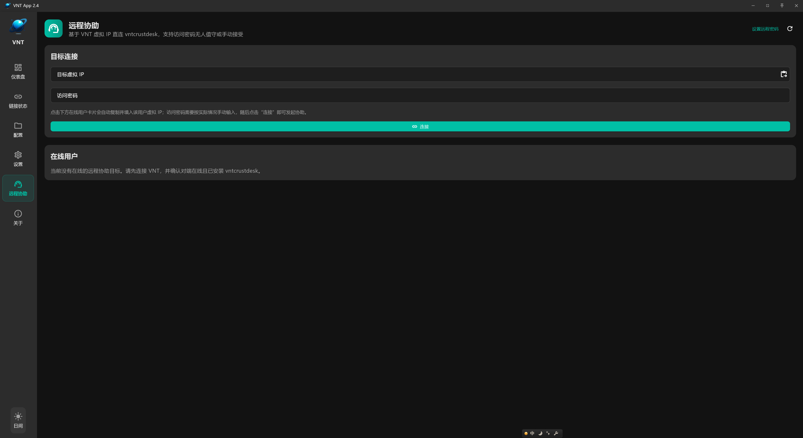

# VNT App

基于 Flutter + Rust 构建的跨平台远程协助与桌面连接工具。

> **对于本项目你可以问问 <a href="https://deepwiki.com/lmq8267/vntAPP"></a> 来了解功能或 `Fork` 后简单的修改一些功能，修改后 GitHub 可以自动打包好**

## 功能截图

### 设备列表 / 连接管理


主界面展示在线/离线设备列表，支持设备搜索、连接管理和状态监控。

### 远程协助


支持远程桌面连接与协助，提供流畅的远程操作体验。

### 设置与配置


灵活的配置选项，支持连接参数、安全设置和个性化定制。

## 主要功能

- **设备管理**：自动发现局域网内设备，在线状态实时显示
- **远程桌面**：低延迟远程桌面连接，支持多分辨率适配
- **远程协助**：安全的远程协助模式，支持会话密码保护
- **跨平台**：支持 Windows 便携版与安装版部署
- **托盘运行**：最小化到系统托盘，后台持续服务

## Build

### 环境要求

安装 [Flutter](https://docs.flutter.dev/get-started/install) 和 [Rust](https://www.rust-lang.org/tools/install) 后，再安装 `flutter_rust_bridge`。

### 运行
```
flutter run
```

### 编译打包

- 便携包：`scripts/export_portable_package.ps1`
- 安装包：`scripts/export_installer_package.ps1`

版本号由 `scripts/build_version.txt` 自动管理，编译成功后自动递增。

## Special

Thanks to ChatGPT for helping with a lot of the work on this project.
